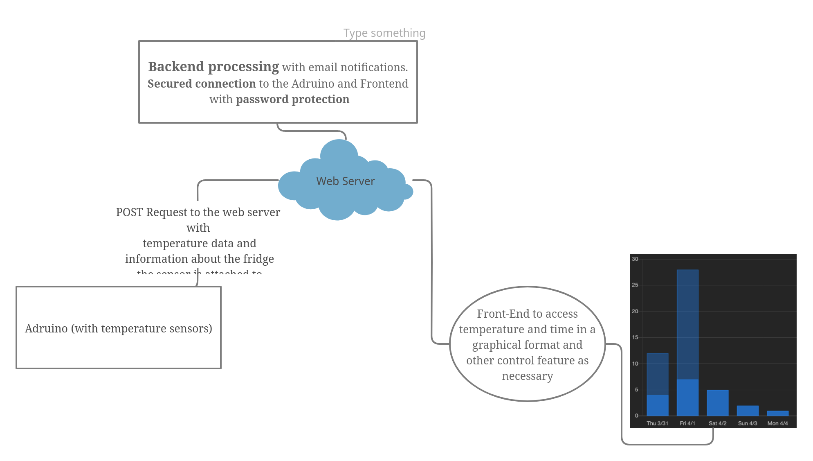
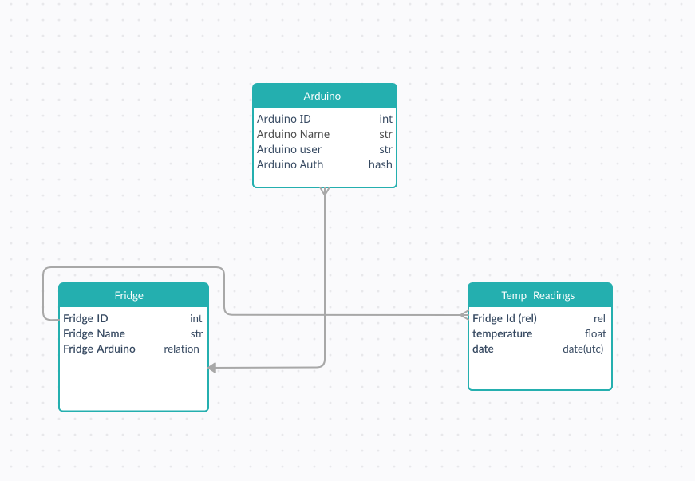
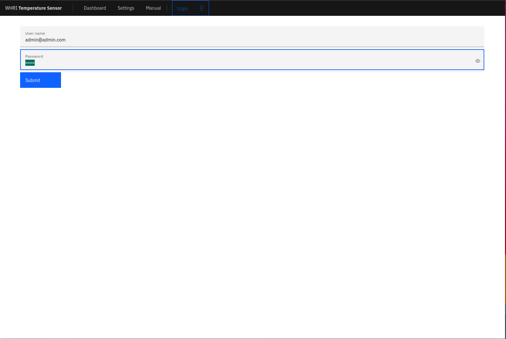
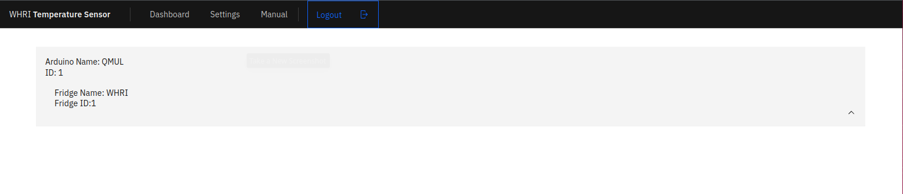
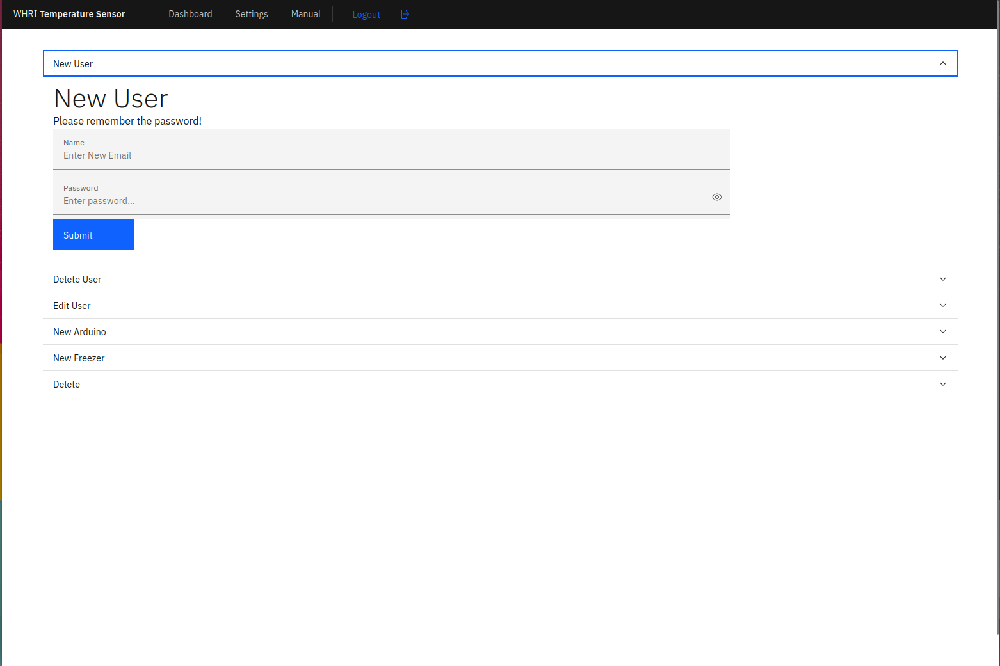

# Temperature Monitor Project

Hello People!

This is a Temperature Monitoring using micro-controllers project. The idea is that there will be micro-controllers like the Arduino ESP-32 that will post data to a server. The server will log this temperature and store it for a month. There will be a website hosted on the same server that will beautifully display this data. The server would also alert by email if the temperature exceeds a certain limit.

This project was done with a laboratory environment in mind, thus try to keep that in mind if you wanted to refactor the code. In this repository, I tried to fit all the code, and I shall break it into the following

- The backend code for the server. This is written in Python using the FasAPI framework. Essentially it’s a bunch of API endpoints manipulating or reading from the database. This could be hosted on Heroku.
- The frontend code for the server. This is the UI to visualize the data and is hosted by the same FastAPI app. It is written in Svelte.
- A sample program for the ESP32 module is connected to a DHT11 sensor, which posts data to the server.

The database was setup with ESP32s connected to multiple temperature sensors in mind. So essentially one board could monitor maybe more than 1 fridge’s temperature. So you can create entries for new Arduinos, and under each Arduino, you could create more entries for sensors/fridges. 

The Arduino entries require you to set up a password so that could be later used for authentication from the micro-controllers. Illustrated much better here:

You could delete the Arduino and Fridge entries if you are an admin. There is only one admin user, which you get by default when deploying the app for the first time. It has the following credentials:

- username: admin@admin.com
- password: admin

You can change the password of the admin (don’t worry!). You could also set up new users, that can only visualize the data and create Arduino and fridge entries.

The code for the Python bit is self-explanatory, but I have left comments here and there. The Svelte bit is split finely into components, I feel you won’t have problems diving in, and the Arduino code have lots of comments.

For some oddball reason, I couldn’t deploy this repository to Heroku, so I made a separate repository for the back-end code, [linked here]('https://github.com/syedzayyan/temp-sensor-backend').

Below there are some pictures of the dashboard after you login, the settings page and the login page.

Home Page

Dashboard

Settings